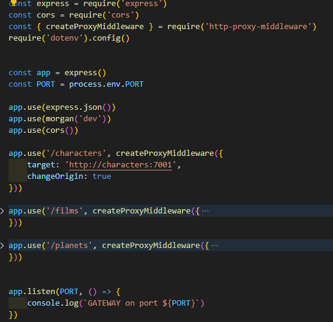
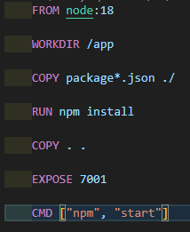
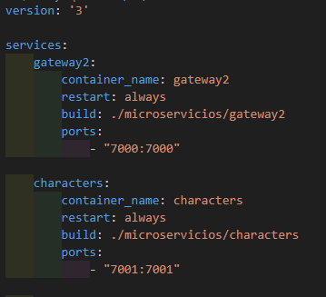
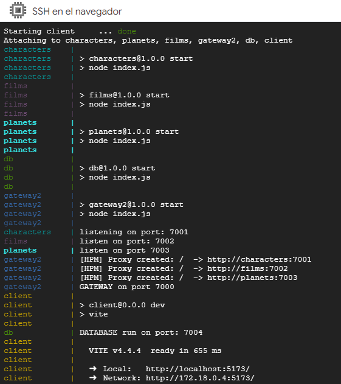

# StarWars_app - UPSKILLING

<figure>
    
</figure>

# Objetivos teóricos a desarrollar
## Microservicios

* Facilita la escalabilidad y la hace más eficiente

* La capacidad de prueba de cada microservicio es mayor.

* El mantenimiento se hace más sencillo y eficiente.

* Permite que en un mismo proyecto coexistan distintas tecnologías: Múltiples lenguajes, bases de datos, protocolos, etc.

* Hace mucho más sencillo el desarrollo paralelo de las distintas funcionalidades de la aplicación y, además, permite que este desarrollo sea independiente.

* Permite que los despliegues sean independientes, lo que aumenta la tolerabilidad a fallos graves.

## Arquitectura de Microservicios:

* Node.js
* Express
* MongoDB
* Docker
* Docker Compose
* Google Cloud Platform MV

# Tareas de desarrollo
## Definir los conceptos de nuestro proyecto:

   * Problema: Introducción al problema y reglas de negocio
   * Modelos: Dominio y entidades
   * Servicios: Tecnologías y organización
   * Creacion de Contenedores: Docker
   * Gateway: Redireccion a los servicios 
   * Gestion de Contenedores: Docker-Compose
   * Despliegue: VM de Google Cloud Platform

### Sobre el Proyecto

_Expone listados de algunos personajes, planetas y films en los cuales intervinieron los personajes de Star Wars._
_Permitirá realizar busquedas por el nombre de cada una de las entidades. Filtrado de personajes segun el planeta de origen._
### Modelos

_Se utiliza base de datos NoSQL, en este caso MongoDB y ORM Mongoose, con clúster alojado en MongoDB Atlas._
_Los modelos para este proyecto son: Character, Film y Planet._
_Cada modelo incluye sus métodos estaticos._

### Servicios

#### characters
- Descripción : Este servicio soporta las peticiones referidas a los personajes de Star Wars.
- Tecnología : Api Rest, Node, Express, javascript.

- Funcionalidad : Manejo de tareas: Creación, Listado, Detalle y Borrado.

- Modelo : colección "characters" que maneja documentos de tipo “Character” que contienen referencias al planeta de nacimiento y a los films en los cuales intervino el personaje.

- Base de datos : MongoDB - Mongo DB Atlas.

    

#### Similares caracteristicas para los modelos: "films" y "planets.
### Gateway

- Descripción : Servicio encargado de centralizar las llamadas a los demás servicios a través de una URI que hace de entrada a esas peticiones.

- Tecnología : Api Rest, Node, Express, http-proxy-middleware.

- Funcionalidad : Se encarga de centralizar las llamadas a la aplicación en una URI principal que redirige las llamadas a los servicios configurados internamente.

_Estructura base del Gateway:_

    

## Contenedores
### Docker - Creacion y Ejecución de imágines

1. creacion de archivo Dockerfile.

    

2. Creacion del archivo .dockerignore

3. Creacion de imágen:  docker build -t "nombre-imagen"

4. Levantar la imagen: docker run -p PORT:PORT "nombre-imagen"

### Docker Compose

_Es una herramienta que facilita la orquestación y gestión de aplicaciones basadas en contenedores Docker._
-Proporciona una forma sencilla y declarativa de definir y ejecutar servicios compuestos por múltiples contenedores._

1. Creacion del archivo en la raiz del directorio del proyecto: docker-compose.yml

    

_Este archivo contendrá la direccion de todas las imagenes que queremos gestionar. (characters, films, planets, gateway, database, etc)._

2. Creacion del contenedor: 
        - docker-compose build

3. Levantar el contenedor: 
        - docker-compose up

4. Detener y eliminar el contenedor: 
        - docker-compose down

## Despliegue en Google Cloud Platform

1. Crear Virtual Machine 

2. Habilitar servicio

3. Crear instancia

4. Abrir consola, actualizar e instalar dependencias
        - sudo apt update
        - sudo apt install git
        - sudo apt install docker.io
        - sudo apt install docker-compose

5. Genero una key ssh para vincular la VM con el repositorio en github: 
        - ssh-keygen -t ed25519 -C "tu email de github" 

6. Ver y copiar key: 
        - cat ~/.ssh/id_ed25519.pub

7. Pegar SSH en Key de github.

8. Clonar el repo en la VM.

9. Crear la imagen: 
        - sudo docker-compose build

10. Levantar el contenedor: 
        - sudo docker-compose up 

    

