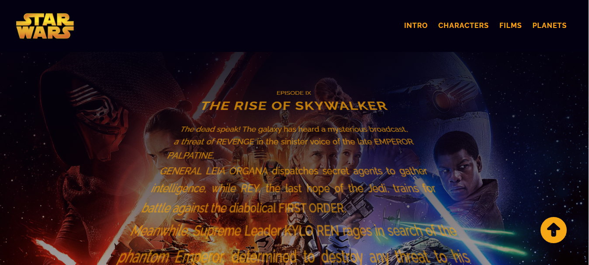
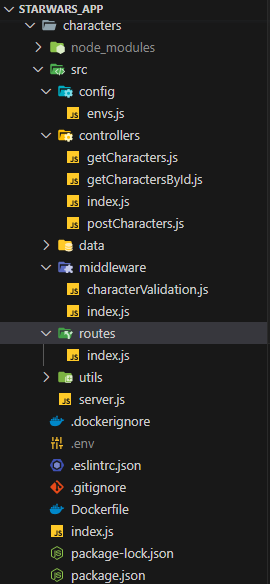

# StarWars_app - UPSKILLING
<picture>

</picture>

# Objetivos teóricos a desarrollar
## Arquitectura de Microservicios:

* Node.js
* Express
* MongoDB
* Docker
* Docker Compose
* Google Cloud Platform MV

# Tareas de desarrollo
## Definir los conceptos de nuestro proyecto:

   * Problema: Introducción al problema y reglas de negocio
   * Modelos: Dominio y entidades
   * Servicios: Tecnologías y organización
   * Creacion de Contenedores: Docker
   * Gateway: Redireccion a los servicios 
   * Gestion de Contenedores: Docker-Compose
   * Despliegue: VM de Google Cloud Platform

### Sobre el Proyecto

_Expone listados de algunos personajes, planetas y films en los cuales intervinieron los personajes de Star Wars._
_Permitirá realizar busquedas por el nombre de cada una de las entidades. Filtrado de personajes segun el planeta de origen._

### Modelos

_Se utiliza base de datos NoSQL, en este caso MongoDB y ORM Mongoose, con clúster alojado en MongoDB Atlas._
_Los modelos para este proyecto son: Character, Film y Planet._
_Cada modelo incluye sus métodos estaticos._

### Servicios

_Los servicios se encuentran desarrollados en Node.js y Express._
_Ejemplo de Estructura de Servicio: 

<figure>

</figure>

#
#
#
